# 无人值守Linux安装镜像制作

## 实现特性

- [x] 定制一个普通用户名和默认密码
- [x] 定制安装OpenSSH Server
- [x] 安装过程禁止自动联网更新软件包

## 实验准备

1. 下载 `Ubuntu 16.04 Server 64bit` 镜像，放入虚拟机
    - 安装 Ubuntu 系统增强功能
    - 创建共享文件夹
    - 注：镜像文件也可以使用sftp传输

2. 定制 preseed 文件
    - 比对老师的 preseed 文件（左）与官方实例文件（右）

    - 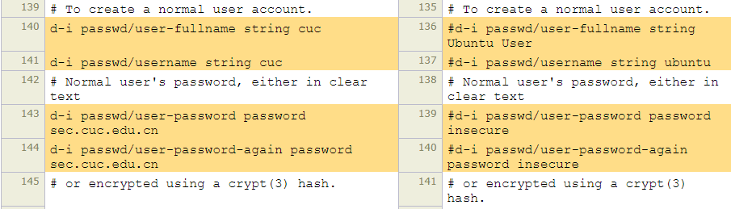
    **设置普通用户名和默认密码**

    - 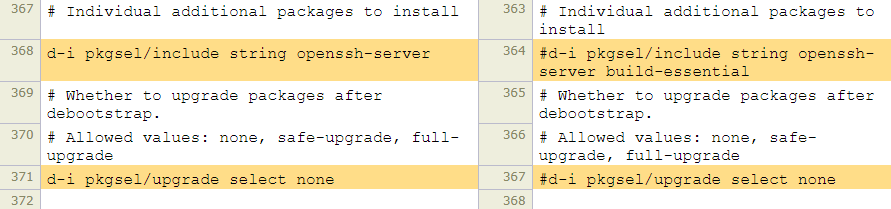
    **安装OpenSSH Server**，同时拒绝在debootstrap后更新包

    - 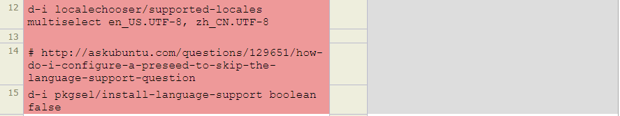
    选择中英双语言环境，并跳过安装时的语言设置项

    - 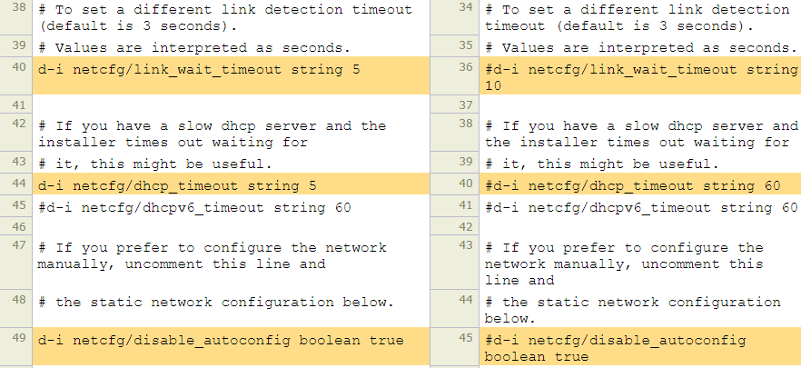  
    设置链路检测5秒超时，dhcp服务器安装5秒超时，手动配置网络

## 实验过程
1. 创建目录`mountpoint`用于挂载iso镜像文件，并将镜像内容克隆到`cd-image`目录下
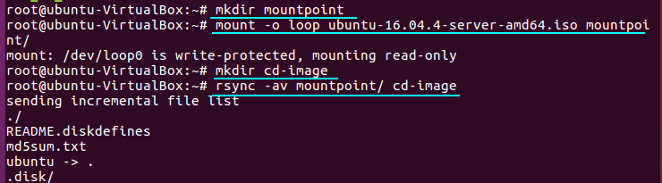

2. 将`autoinstall`标签写入`add_to_txt`文件中，并追加到`txt.cfg`文件后，将该文件中的`default`选项改为`autoinstall`

    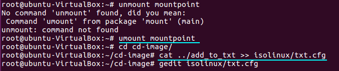

    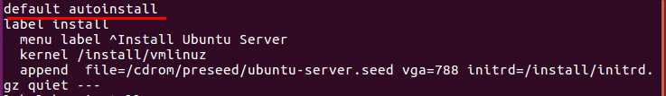

    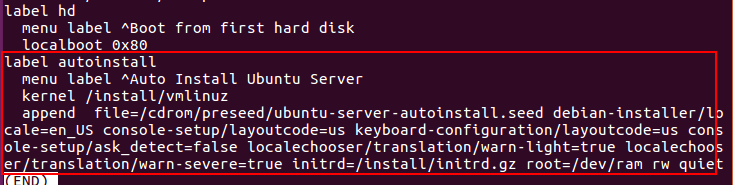

    - 然而实验过程中发现`default`标签并没有作用。必须将`autoinstall`标签放在所有标签之前，才可以默认选择`autoinstall`标签，可能是因为会从上往下读取`txt.cfg`的标签内容


3. 将`ubuntu-server-autoinstall.seed`保存到`/cd-image/preseed`路径下，
修改`isolinux/isolinux.cfg`，增加内容`timeout 10`

    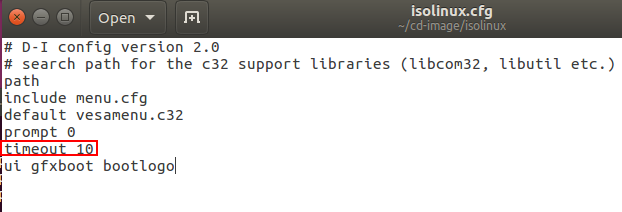

    - 老师批注：其实，既然是全自动安装，完全没必要等待 10 秒，你可以试试 timeout 0

    - 然而在重新实验验证时，如果是`timeout 0`，则安装界面会停止在选择语言界面，需要手动选择安装类型标签。似乎`timeout 0`会无限等待，因此仍然保留`timeout 10`

    - ref: [Prevent Language selection at ubuntu installation](https://unix.stackexchange.com/questions/196874/prevent-language-selection-at-ubuntu-installation)


4. 重新生成md5值，并生成镜像

    - 注意BUILD变量一定要写绝对路径

    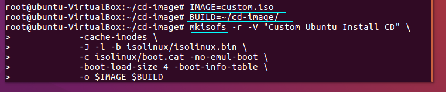


## 实验结果

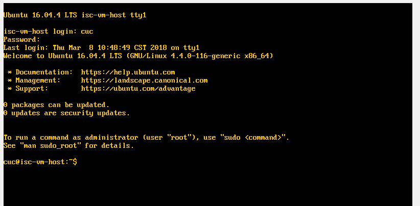

## 实验问题

1. Virtualbox安装完Ubuntu之后新添加的网卡如何实现系统开机自动启用和自动获取IP
    - 在`/etc/network/interfaces`文件中添加
    ```
    auto enp0s8
    iface enp0s8 inet dhcp
    ```
    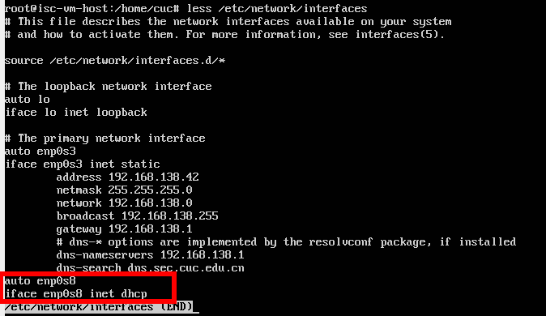

    重启后NAT网卡获得IP地址

    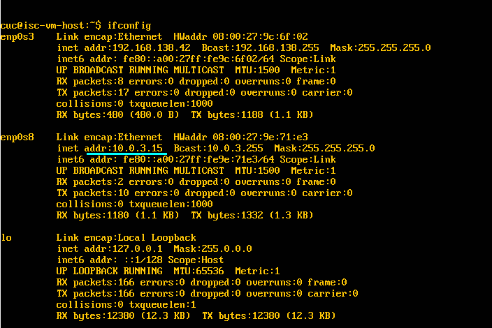

2. ssh 连接虚拟机并实现免输入用户名、密码登录
    - 虚拟机使用host-only网卡，并手动配置地址为`192.168.178.100`
    - 下载并启用openssh Server  
    ```
    $ apt-get install openssh-server    
    $ service ssh start
    ```

    - 用putty生成公私钥对，将公钥写入`/home/hkl/.ssh/authorized_keys`，设置私钥和用户名
    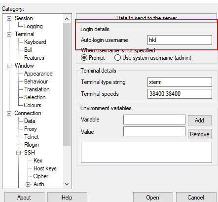

    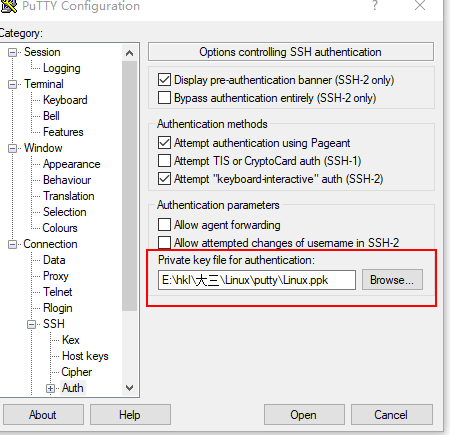

    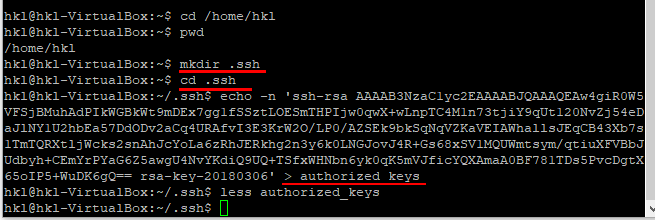

    - 实现免密登录  
    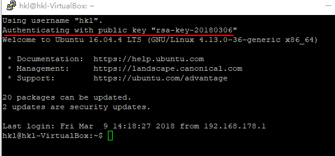

3. 如何使用sftp在虚拟机和宿主机之间传输文件

    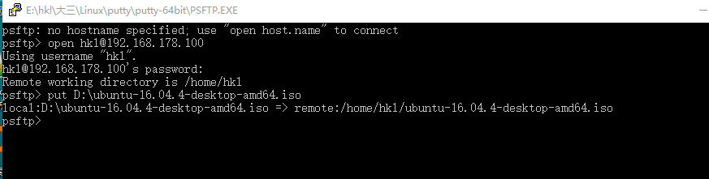

    - 没有创建共享文件夹时，可以使用sftp（put指令）传输文件

## 参考链接
- [Linux基础实验(第一章)](http://sec.cuc.edu.cn/huangwei/course/LinuxSysAdmin/chap0x01.exp.md.html#/linux)
- [Install Ubuntu Server](https://tutorials.ubuntu.com/tutorial/tutorial-install-ubuntu-server#0)
- [InstallCDCustomization](https://help.ubuntu.com/community/InstallCDCustomization)
- [ubuntu下自动获取IP配置](http://m.jishurensheng.com/800681582.html)
