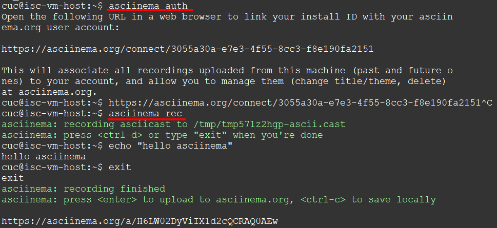
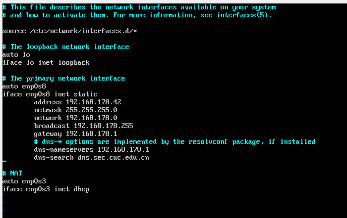
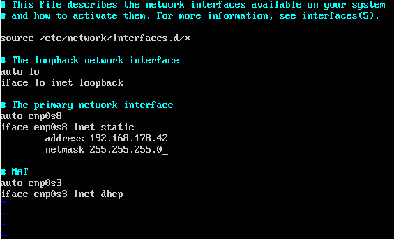
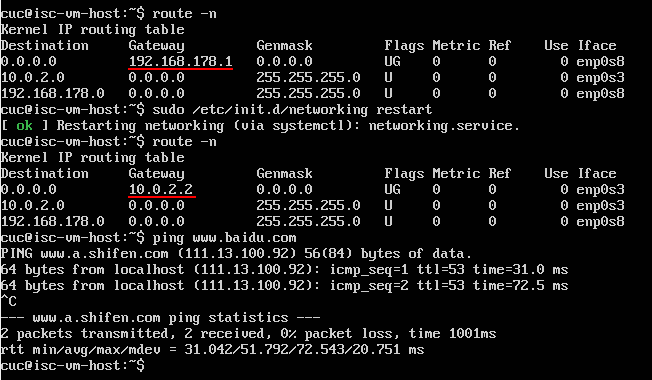
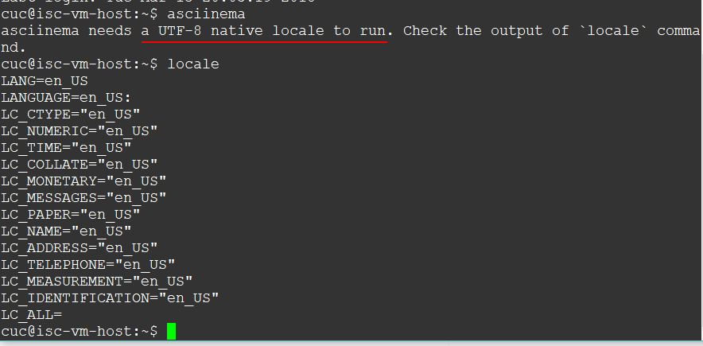
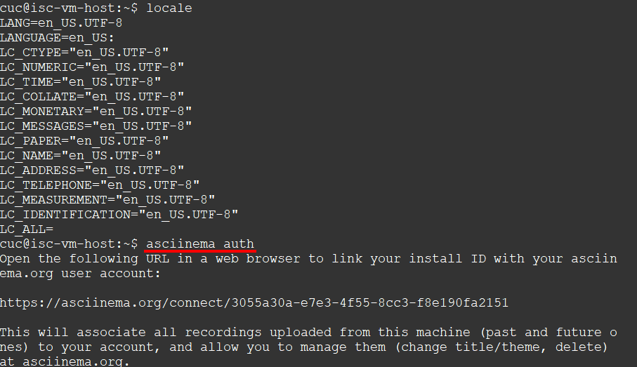

# VIMTUTOR

## 实验准备

- ubuntu上安装asciinema

```
sudo apt-add-repository ppa:zanchey/asciinema
sudo apt-get update
sudo apt-get install asciinema
```

- 注册asciinema账号，并关联本地账号和在线账号



## 录制视频

- [54min](https://asciinema.org/a/99Wul3gRZFF0Y5YiWBlE3hTyi)

- 注意区分指令大小写，空格及回车键不能缺少或随意添加，不要忘记写冒号


## 实验问题

1. 你了解vim有哪几种工作模式？
    - Normal mode `<ESC>`
    - Insert mode `<i>`
    - Replace mode `<R>`
    - Visual mode `<v>`

2. Normal模式下，从当前行开始，一次向下移动光标10行的操作方法？如何快速移动到文件开始行和结束行？如何快速跳转到文件中的第N行？
    - `10 j` 一次向下移动10行
    - `G` 移到文件结束行
    - `gg` 移到文件开始行
    - `N G` 跳转到文件第N行

3. Normal模式下，如何删除单个字符、单个单词、从当前光标位置一直删除到行尾、单行、当前行开始向下数N行？
    - `x` 删除单个字符
    - `dw` `de` 删除单个单词
    - `d$` 当前光标删除到行尾
    - `dd` 删除单行
    - `N dd` 删除当前行开始向下数N行

4. 如何在vim中快速插入N个空行？如何在vim中快速输入80个-？
    - `N o <ESC>` 快速插入N个空行
    - `80i-<ESC>` 快速输入80个-

5. 如何撤销最近一次编辑操作？如何重做最近一次被撤销的操作？
    - `u`
    - `CTRL-R`

6. vim中如何实现剪切粘贴单个字符？单个单词？单行？如何实现相似的复制粘贴操作呢？
    - 将光标移到要复制的单个字符处，按`x`，移动到要粘贴的地方按`p`
    - `dw` + `p` 剪切粘贴单个单词
    - `dd` + `p` 剪切粘贴单行
    - 按`v`进入Visual mode，选中要复制的内容，按`y`，移动到要粘贴的地方按`p`

7. 为了编辑一段文本你能想到哪几种操作方式（按键序列）？
    - `:q!` 不保存退出
    - `:wq` 保存退出
    - `:w 文件名` 新建文件并保存到该文件中

8. 查看当前正在编辑的文件名的方法？查看当前光标所在行的行号的方法？
    - `CTRL-G`

9. 在文件中进行关键词搜索你会哪些方法？如何设置忽略大小写的情况下进行匹配搜索？如何将匹配的搜索结果进行高亮显示？如何对匹配到的关键词进行批量替换？
    - `/ 关键词` 前向搜索关键词
    - `? 关键词` 后向搜索关键词
    - `:set ic` 忽略大小写
    - `:set hls` 对匹配结果进行高亮显示
    - `:s/old/new/g` 在单行批量替换，`:#,#s/old/new/g`在两行间批量替换，`:%s/old/new/g` 在全文中批量替换

10. 在文件中最近编辑过的位置来回快速跳转的方法
    - `CTRL-O` 返回上次位置
    - `CTRL-I` 前往新位置

11. 如何把光标定位到各种括号的匹配项？例如：找到(, [, or {对应匹配的),], or }
    - `%`

12. 在不退出vim的情况下执行一个外部程序的方法？
    - `:!command`

13. 如何使用vim的内置帮助系统来查询一个内置默认快捷键的使用方法？如何在两个不同的分屏窗口中移动光标？
    - `:help cmd`
    - `CTRL-W CTRL-W` 在两个窗口间移动

## Trouble Shooting

1. 虚拟机配置 host-only + NAT双网卡后，无法连接外网，只能连接主机

    解决方法：将 `/etc/network/interfaces`中`host-only`网卡有关网关和DNS服务器的内容删掉即可。

    

    

    原因是手动配置的网关地址覆盖了NAT网卡DHCP自动分配的网关地址，更改并重启网络后可看到网关发生变化

    

    - 参考：[How to set up NAT and Host-Only networking with static IP address in VirtualBox](https://askubuntu.com/questions/446183/how-to-set-up-nat-and-host-only-networking-with-static-ip-address-in-virtualbox)

2. asciinema 要求本地语言环境为`UTF-8`

    

    解决方法：
    ```
    # update-locale LANG=en_US.UTF-8
    ```

    不再报错
    

    - 参考： [Configure Locales in Ubuntu](https://www.thomas-krenn.com/en/wiki/Configure_Locales_in_Ubuntu)
