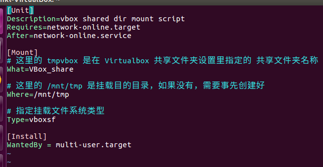
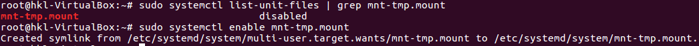
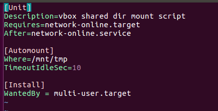
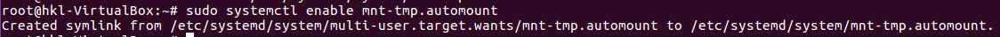
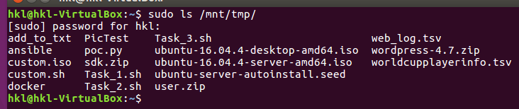

## 参考：

- [CUCCS/2015-linux-public-songyawen#2 (comment)](https://github.com/CUCCS/2015-linux-public-songyawen/pull/2#discussion_r176981741)
- [How do I install Guest Additions in a VirtualBox VM?](https://askubuntu.com/questions/22743/how-do-i-install-guest-additions-in-a-virtualbox-vm/22745#22745)

## 步骤

pre: 安装增强功能，否则无法识别vboxsf类型

1. sudo vi /etc/systemd/system/mnt-tmp.mount
mkdir /mnt/tmp

    

2. sudo systemctl list-unit-files | grep mnt-tmp.mount
sudo systemctl enable mnt-tmp.mount

    

3. sudo vi /etc/systemd/system/mnt-tmp.automount

    

4. sudo systemctl enable mnt-tmp.automount
    

5. 重启，且只有当有进程访问到共享目录的挂载点 /mnt/tmp 时，目录才会自动挂载

    
