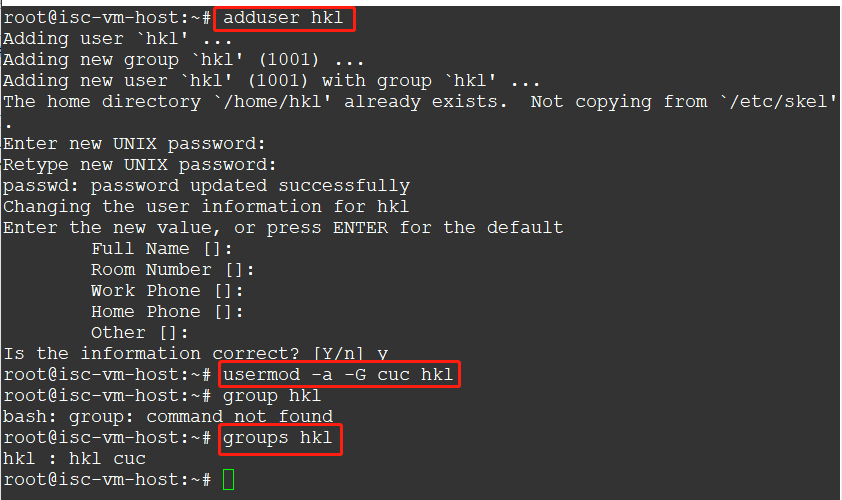
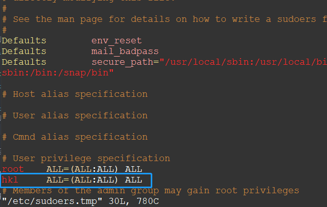
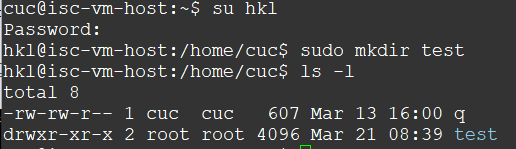
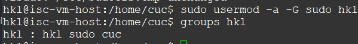
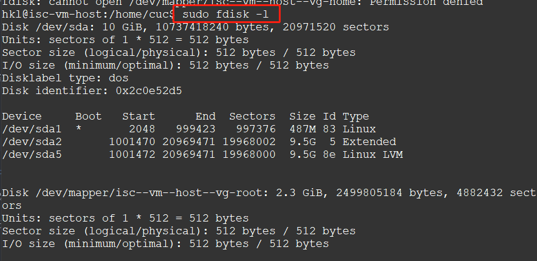

# Systemd 入门教程 by 阮一峰的网络日志

## 命令篇

1. 系统管理
    - [systemd-analyze](https://asciinema.org/a/gUvYDO57btKoee65Jg5FdgElo)
    - [hostnamectl](https://asciinema.org/a/OvGXIXcRPmBr0bQjdDwR6rme3
)
    - [localectl & timedatectl](https://asciinema.org/a/n6WUmWgG7BeaLgH4nJIrUneul)
    - [loginctl](https://asciinema.org/a/SG3DxjxAYsEM4D5ogJQOGuHXG)

2. Unit
    - [查看Unit](https://asciinema.org/a/nYj1s47s7LWN61ayncJ6SOSi1)
    - [Unit状态](https://asciinema.org/a/bR2Vpu9jbuWMZic03FTEbmfEc)
    - [Unit管理](https://asciinema.org/a/uwC55Z0iDr5V1gDNTs7j9AuM4)
    - [依赖关系](https://asciinema.org/a/B6SOIUefpFfsJFDbDt3pxDU4s)

3. [Unit的配置文件](https://asciinema.org/a/1UYSWllWPPkwHm9V9qMcszFiz)

4. [Target](https://asciinema.org/a/mP0RqBdPtPLPZLCVxFxtUC1Ne)

5. 日志管理
    - [journalctl](https://asciinema.org/a/X7IpYpan91VkRyxx4RBCX1U0C)

## 实战篇

- [相关指令](https://asciinema.org/a/Q3Vwa4LfMx0M24QMB5NyG3sOg)
- 已阅读配置文件部分

## 自查清单

1. 如何添加一个用户并使其具备sudo执行程序的权限
    

    在`/etc/sudoers`文件中添加图中蓝框内的内容
    

    
2. 如何将一个用户添加到一个用户组

    将用户`hkl`添加到`sudo`用户组

    
    

3. 如何查看当前系统的分区表和文件系统详细信息

    

4. 如何实现开机自动挂载Virtualbox的共享目录分区
    - 在`/etc/fstab`文件中添加
    `sharing /mnt/share vboxsf defaults 0 0`

5. 基于LVM（逻辑分卷管理）的分区如何实现动态扩容和缩减容量
    - 在`ext`文件系统中：
    - LVM扩容
        ```
        umount  /mnt/  
        mkfs.ext4  /dev/vg1/lv1  
        lvextend  -L 400M  /dev/vg1/lv1  
        resize2fs  /dev/vg1/lv1
        ```
    - LVM缩减
        ```
        umount  /mnt/
        e2fsck -f /dev/vg1/lv1  
        resize2fs  /dev/vg1/lv1  200M  
        mount  /dev/vg1/lv1   /mnt/  
        ```

6. 如何通过systemd设置实现在网络连通时运行一个指定脚本，在网络断开时运行另一个脚本
    - 更改该网络服务的配置文件s
    - 网通连通时运行指定脚本
    ```
    [Service]  
    ...  
    ExecStart: path-of-script -D $OPTIONS  
    ...
    ```
    - 网络断开时运行另一个脚本
    ```
    [Service]  

    ...  
    ExecStop: path-of-script -D $OPTIONS  
    ...

    ```

7. 如何通过systemd设置实现一个脚本在任何情况下被杀死之后会立即重新启动？实现杀不死
    - 设置该脚本配置文件
    ```
    [Service]  
    ...  
    Restart:always  
    ...
    ```


## 参考链接

- [“Unable to locate package” while trying to install packages with APT](https://askubuntu.com/questions/378558/unable-to-locate-package-while-trying-to-install-packages-with-apt)
- [Linux中LVM动态扩容和管理](http://blog.51cto.com/13355576/1980143)
