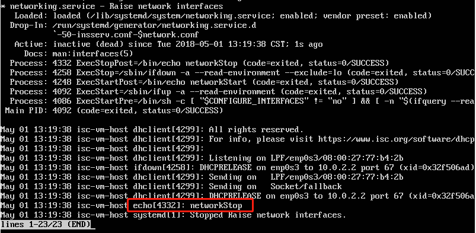

# Systemd 入门教程 by 阮一峰的网络日志

## 命令篇

1. 系统管理
    - [systemd-analyze](https://asciinema.org/a/gUvYDO57btKoee65Jg5FdgElo)
    - [hostnamectl](https://asciinema.org/a/OvGXIXcRPmBr0bQjdDwR6rme3
)
    - [localectl & timedatectl](https://asciinema.org/a/n6WUmWgG7BeaLgH4nJIrUneul)
    - [loginctl](https://asciinema.org/a/SG3DxjxAYsEM4D5ogJQOGuHXG)

2. Unit
    - [查看Unit](https://asciinema.org/a/nYj1s47s7LWN61ayncJ6SOSi1)
    - [Unit状态](https://asciinema.org/a/bR2Vpu9jbuWMZic03FTEbmfEc)
    - [Unit管理](https://asciinema.org/a/uwC55Z0iDr5V1gDNTs7j9AuM4)
    - [依赖关系](https://asciinema.org/a/B6SOIUefpFfsJFDbDt3pxDU4s)

3. [Unit的配置文件](https://asciinema.org/a/1UYSWllWPPkwHm9V9qMcszFiz)

4. [Target](https://asciinema.org/a/mP0RqBdPtPLPZLCVxFxtUC1Ne)

5. 日志管理
    - [journalctl](https://asciinema.org/a/X7IpYpan91VkRyxx4RBCX1U0C)

## 实战篇

- [相关指令](https://asciinema.org/a/Q3Vwa4LfMx0M24QMB5NyG3sOg)
- 已阅读配置文件部分

## 自查清单

1. 如何添加一个用户并使其具备sudo执行程序的权限
    

    在`/etc/sudoers`文件中添加图中蓝框内的内容（**注意：** 以后应避免通过直接编辑 /etc/sudoers 的方式来给一个用户添加 sudo 权限。如果需要的话，把该用户加入到 sudo 用户组即可）

    

    

2. 如何将一个用户添加到一个用户组

    将用户`hkl`添加到`sudo`用户组

    
    

3. 如何查看当前系统的分区表和文件系统详细信息

    

4. 如何实现开机自动挂载Virtualbox的共享目录分区

    - 直接设置虚拟机共享文件夹的属性为`自动挂载`，对`ubuntu-server`似乎没有用，重启后虚拟机中仍然没有挂载共享文件夹

    - 参考：[分享Virtualbox Ubuntu 共享文件夹、自动挂载的一些问题](https://blog.csdn.net/skylake_/article/details/53132499)，先进行挂载文件夹操作

    - 在进行挂载过程中由于`vboxsf`类型无法识别，需要安装虚拟机增强功能，但安装失败

    

    

    - 参考：[Unable to mount the CD/DVD image on the machine Sandbox](https://askubuntu.com/questions/321589/unable-to-mount-the-cd-dvd-image-on-the-machine-sandbox) 并借助PSFTP实现安装增强功能，挂载成功不会报错

    

    - 在`/etc/fstab`文件添加 `VBox_share /mnt/share vboxsf defaults 0 0`，并重启，系统进入了不正常的页面，看了很多帖子，仍不明白原理和解决方法

    

    - [**更清晰更systemd的实现方法**](automount.md)


5. 基于LVM（逻辑分卷管理）的分区如何实现动态扩容和缩减容量
    - 在`ext`文件系统中：
    - LVM扩容  
        ```
        umount  /mnt/  
        mkfs.ext4  /dev/vg1/lv1  
        lvextend  -L 400M  /dev/vg1/lv1  
        resize2fs  /dev/vg1/lv1
        ```

    - LVM缩减  
        ```
        umount  /mnt/
        e2fsck -f /dev/vg1/lv1  
        resize2fs  /dev/vg1/lv1  200M  
        mount  /dev/vg1/lv1   /mnt/  
        ```

6. 如何通过systemd设置实现在网络连通时运行一个指定脚本，在网络断开时运行另一个脚本
    - 更改网络服务的配置文件`/lib/systemd/system/networking.service`
    - 网通连通后运行指定脚本  
    ```

    [Service]  
    ...  
    ExecStartPost: path-of-script -D $OPTIONS  
    ...

    ```
    - 网络断开后运行另一个脚本  
    ```

    [Service]  
    ...  
    ExecStopPost: path-of-script -D $OPTIONS  
    ...

    ```

    

    - `sudo systemctl daemon-reload`

    - 启动或关闭网络服务，只能在status中看到效果

        > sudo systemctl [start|stop|status] networking.service

        

        

    - 注意如果是要执行脚本，一定要写清楚绝对路径(包括脚本中的路径也必须是绝对路径)

        

7. 如何通过systemd设置实现一个脚本在任何情况下被杀死之后会立即重新启动？实现杀不死
    - 设置该脚本配置文件(图例为sshd.service)

    

    - 但是，即便设置为`always`，当使用`systemctl stop`关闭时，或退出状态码在`RestartPreventExitStatus`中设定过的话，也无法重启。资料中说设置`RestartForceExitStatus`可以强制重启，但这个设置对`systemctl stop`也无效。。

    - 参考：[systemd.service — Service unit configuration](https://www.freedesktop.org/softwre/systemd/man/systemd.service.html)

    > As exceptions to the setting above, the service will not be restarted if the exit code or signal is specified in RestartPreventExitStatus= (see below) or the service is stopped with systemctl stop or an equivalent operation. Also, the services will always be restarted if the exit code or signal is specified in RestartForceExitStatus= (see below).

## 参考链接

- [“Unable to locate package” while trying to install packages with APT](https://askubuntu.com/questions/378558/unable-to-locate-package-while-trying-to-install-packages-with-apt)
- [Linux中LVM动态扩容和管理](http://blog.51cto.com/13355576/1980143)
