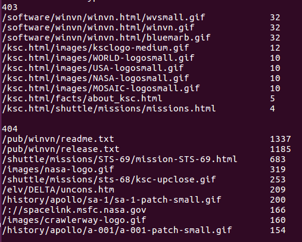
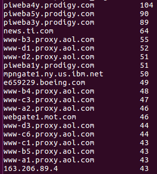

# shell脚本编程

## 课内实验（求两个数最大公约数）

> 快速熟悉shell语法

- 代码

```bash

#!/bin/bash

function gcd {
	i=$1
	while [ "$i" -ge 1 ]; do
		if [[ $(($1 % i)) == 0 && $(($2 % i)) == 0 ]];then
			echo "$i"
			break
		fi
		i=$((i-1));
	done
}


function judge {
	mark=1
	if [[ $# -ne 2 ]];then
		echo "Error!! You have to input exact 2 numbers"
	else
		for i in "$@"; do
			#if [[ $(bc <<< scale($i)) -ne 0]]; then
			if [[ ! -z  "$(echo "$i" | grep '[.]')" ]];  then
				echo "Error!! You should not have input floating point"
				mark=0
			elif [[ ! -z "$( echo "$i" | grep '[a-zA-Z]' )" ]]; then
				echo "Error!! You should not have input characters"
				mark=0
			fi
		done

		if [[ $mark -eq 1 ]]; then gcd "$1" "$2"
		fi
	fi
}

judge "$@"


```

- 测试


## 任务一（图片批处理）

- [code](Code/Task_1.sh)

- 测试

	```bash

	# help 帮助文档
	sudo bash task1.sh -h

	```

	

	```bash

	# 对jpeg格式图片进行图片质量压缩
	sudo bash task1.sh -d PicTest/ -j 45

	```

	

	```bash

	# 对jpeg/png/svg格式图片在保持原始宽高比的前提下压缩分辨率
	sudo bash task1.sh -d PicTest/ -c 100

	```

	

	```bash

	# 对图片批量添加自定义文本水印
	sudo bash task1.sh -d PicTest/ -e "Sahara"

	```

	

	```bash

	# 批量重命名（统一添加文件名前缀或后缀，不影响原始文件扩展名）
	sudo bash task1.sh -d PicTest/ -p "pre"
	sudo bash task1.sh -d PicTest/ -s "Heap"

	```

	

	

	```bash

	# 将png/svg图片统一转换为jpg格式图片
	sudo bash task1.sh -d PicTest/ -v

	```

	

- 参考：
	- [How to Quickly Resize, Convert & Modify Images from the Linux Terminal](https://www.howtogeek.com/109369/how-to-quickly-resize-convert-modify-images-from-the-linux-terminal/)
	- [Example Usage of the Composite Command](https://www.imagemagick.org/script/composite.php)

## 任务二（运动员）

- [code](Code/Task_2.sh)

> 此任务是手动构造字典的（手动维持键唯一性及统计次数），代码繁杂，对于此题来说尚可以接受。但对于大数据量（如最后一个任务）运行时间过长，经同学提醒 + 借鉴师哥师姐作业，最后一个任务使用了`awk`神器

- 测试
	- 统计不同年龄区间范围（20岁以下、[20-30]、30岁以上）的球员数量、百分比；年龄最大的球员是谁？年龄最小的球员是谁？

	

	- 统计不同场上位置的球员数量、百分比

	

	- 名字最长的球员是谁？名字最短的球员是谁

	```
	不知道什么原因，第一个名字的两个单词会换行输出
	```

	

- 参考：
	- [How to define hash tables in Bash?
](https://stackoverflow.com/questions/1494178/how-to-define-hash-tables-in-bash)

## 任务三（Web服务器）

- [code](Code/Task_3.sh)

- 测试（为便于展示，只打印出top20，可由参数num控制）
	```bash
	# --help帮助文档
	bash Task_3.sh --help  
	```

	

	```bash
	# 统计访问来源主机TOP 100和分别对应出现的总次数
	bash Task_3.sh -d ./web_log.tsv -h 20  
	``` 

	

	```bash
	# 统计访问来源主机TOP 100 IP和分别对应出现的总次数
	bash Task_3.sh -d ./web_log.tsv -i 20  
	```

	

	```bash
	# 统计最频繁被访问的URL TOP 100
	bash Task_3.sh -d ./web_log.tsv -u 20  
	```

	

	```bash
	# 统计不同响应状态码的出现次数和对应百分比
	bash Task_3.sh -d ./web_log.tsv -r  
	```

	

	```bash
	# 分别统计不同4XX状态码对应的TOP 10 URL和对应出现的总次数
	bash Task_3.sh -d ./web_log.tsv -x 10  
	```

	

	```bash
	# 给定URL输出TOP 100访问来源主机
	bash Task_3.sh -d ./web_log.tsv -l "/images/launchmedium.gif"  
	```

	
