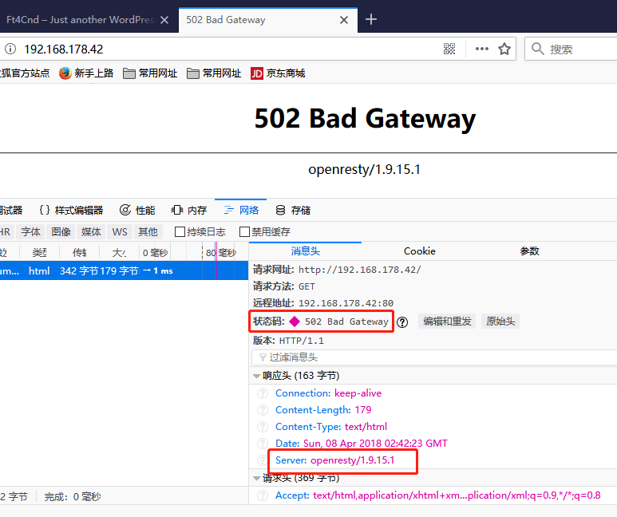
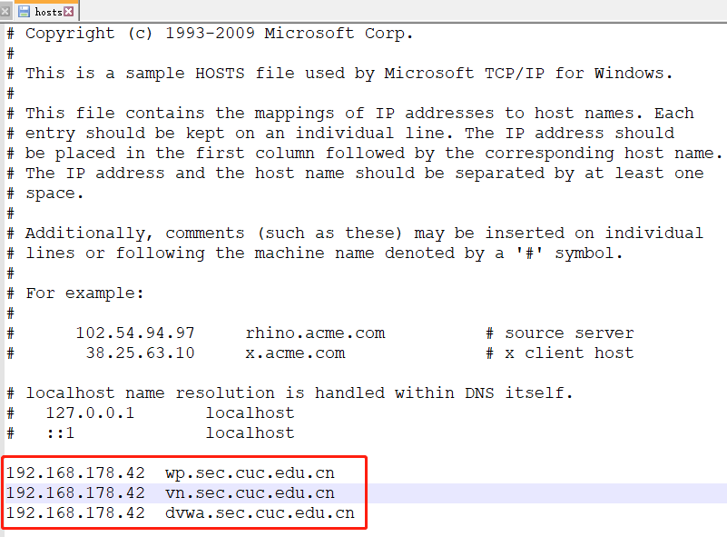
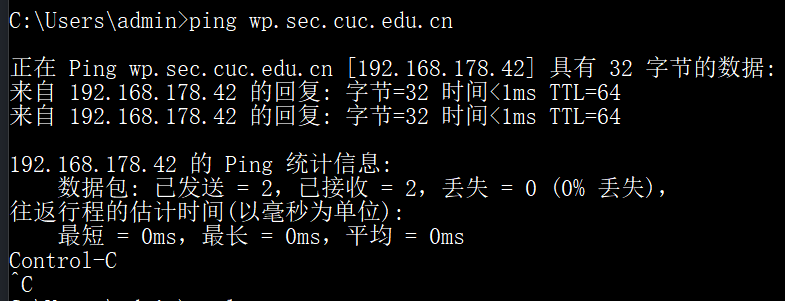
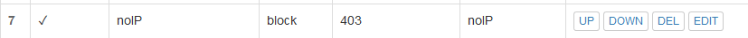
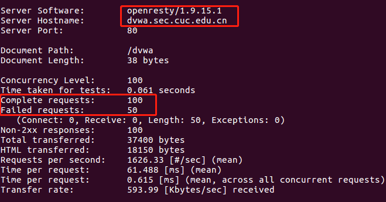

# WEB 服务器

# 思路一（未实现）

## 实验环境

- 一台ubuntu-server-16.04
    - hostonly网卡192.168.178.42
    - 部署 veynginx(80端口) + wordpress(8000/443端口) + DVWA(8080端口)
- 客户端 windows10

### [安装verynginx (80端口)](https://github.com/alexazhou/VeryNginx/blob/master/readme_zh.md)

- git clone https://github.com/alexazhou/VeryNginx.git
- sudo apt install libpcre3 libpcre3-dev libssl-dev build-essential
- sudo python install.py install
- 将`/opt/verynginx/openresty/nginx/conf/nginx.conf `文件第二行改为`user www-data`
- 启动服务 sudo
 /opt/verynginx/openresty/nginx/sbin/nginx

### [nginx + PHP-FPM搭建WordPress站点](https://www.digitalocean.com/community/tutorials/how-to-install-wordpress-with-lemp-on-ubuntu-16-04)

- [Install a LEMP stack](https://www.digitalocean.com/community/tutorials/how-to-install-linux-nginx-mysql-php-lemp-stack-in-ubuntu-16-04)
    - 将nginx监听端口设为8000和443
        - 更改`/etc/nginx/sites-enabled/default`文件前几行为 `server{ listen  8000 }`
        - sudo service nginx restart
- [Secure your site with SSL](https://www.digitalocean.com/community/tutorials/how-to-create-a-self-signed-ssl-certificate-for-nginx-in-ubuntu-16-04)

### [安装DVWA](https://www.youtube.com/watch?v=5BG6iq_AUvM)

- 将apache2监听端口改为8080
    - `/etc/apache2/ports.conf`

## 问题

- 443端口可正常访问，但8000端口和80端口无法正常访问

    - 使用8000端口访问WordPress会被[301重定向](https://airbrake.io/blog/http-errors/301-moved-permanently)到80端口
    - 使用80端口并不能访问verynginx页面，而会显示WordPress页面，但访问的服务器是不同的。原因在于二者网页根目录相同，导致访问页面混杂

- 将WordPress关闭，导致verynginx也无法打开。

- 原因为：verynginx和WordPress都基于底层nginx服务器的配置，对/etc/nginx/sites-available/default的更改导致WordPress和verynginx均监听8000端口

- [nginx配置文件](config/nginx.txt)
- [verynginx配置文件](config/verynginx.txt)

# 思路二

## 实验环境

- verynginx
    - ubuntu-server-16.04
    - hostonly网卡192.168.178.42
- DVWA (8080) && WordPress (80)
    - ubuntu-desktop-16.04
    - hostonly网卡192.168.178.101

## 基本要求

1. VeryNginx作为本次实验的Web App的反向代理服务器和WAF
    - 配置

    

    - 实现

    

    

    - 问题：无法访问`https://wp.sec.cuc.edu.cn`

    

    - 可以使用IP地址`https://192.168.178.101`访问，检查`/var/log/nginx/error.log`、`/var/log/nginx/access.log`和证书文件`/etc/ssl/certs/nginx-selfsigned.cert`,未发现错误

    

    

2. 使用Wordpress搭建的站点对外提供访问的地址为： https://wp.sec.cuc.edu.cn 和 http://wp.sec.cuc.edu.cn  
使用Damn Vulnerable Web Application (DVWA)搭建的站点对外提供访问的地址为： http://dvwa.sec.cuc.edu.cn
    - 配置hosts文件

    

    - 但使用Chrome浏览器无法访问

    

    - 尝试[清除浏览器DNS缓存](https://www.zhihu.com/question/19721279)无效
    - 但是可以ping通域名

    

    - 且使用火狐浏览器可正常访问

    

## 安全加固要求

1. 使用IP地址方式均无法访问上述任意站点，并向访客展示自定义的友好错误提示信息页面-1

    - 设置Matcher匹配，Response响应和Filter过滤

    

    

    

    - 效果

    

2. Damn Vulnerable Web Application (DVWA)只允许白名单上的访客来源IP，其他来源的IP访问均向访客展示自定义的友好错误提示信息页面-2

    - 设置Matcher匹配，Response响应和Filter过滤

    

    

    

    - 效果（使用ubuntu-desktop 192.168.178.101访问）

    

3. 在不升级Wordpress版本的情况下，通过定制VeryNginx的访问控制策略规则，热修复WordPress < 4.7.1 - Username Enumeration

    - Matcher

    

    - 效果

    

4. 通过配置VeryNginx的Filter规则实现对Damn Vulnerable Web Application (DVWA)的SQL注入实验在低安全等级条件下进行防护

    

    - 漏洞

    

    - verynginx配置

    

    - 效果

    

## VERYNGINX配置要求

1. VeryNginx的Web管理页面仅允许白名单上的访客来源IP，其他来源的IP访问均向访客展示自定义的友好错误提示信息页面-3
    - 设置Matcher匹配，Response响应和Filter过滤

    

    

    

    - 效果(使用物理主机192.168.178.1访问)

    

2. 限制DVWA站点的单IP访问速率为每秒请求数 < 50

    - 

    - 配置`/etc/hosts`文件

    - ab -n 100 -c 100 http://dvwa.sec.cuc.edu.cn/dvwa

    
3. 限制Wordpress站点的单IP访问速率为每秒请求数 < 20

    > ab -n 100 -c 100 http://wp.sec.cuc.edu.cn/

    

4. 超过访问频率限制的请求直接返回自定义错误提示信息页面-4

    > sudo curl http://wp.sec.cuc.edu.cn/?[1-25]

    参考链接：[Curl Command to Repeat URL Request
](https://stackoverflow.com/questions/12409519/curl-command-to-repeat-url-request)

    - 效果

    

5. 禁止curl访问

    - 设置Matcher,Response,Filter

    

    

    

    - 效果

    
