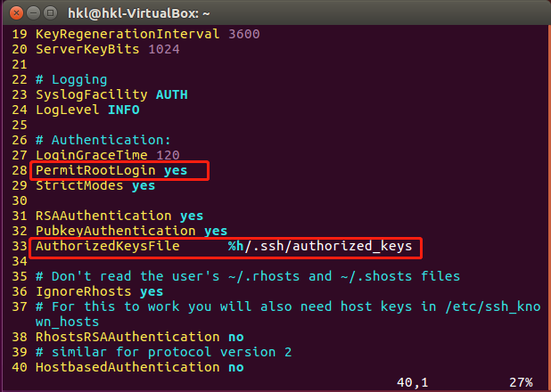
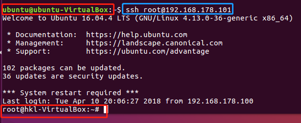

## [ssh免密root登录] 操作步骤

### 目标主机配置

- 开启目标主机ssh服务

    ` sudo service ssh start`

- 更改ssh配置文件 `/etc/ssh/sshd_config`

    

### 工作主机配置

- 生成一对公私钥

    `ssh-keygen -t rsa`

- 将公钥传输至目标主机`authorized_keys`文件

    `ssh-copy-id root@192.168.178.101`

    - 注意此处用户名应为root

- 连接

    
