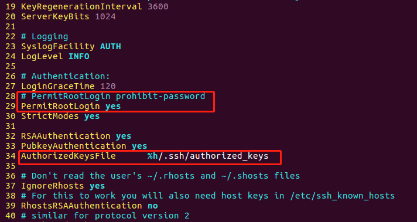

## [ssh免密root登录] 操作步骤

### 目标主机配置

- 开启目标主机ssh服务

    ` sudo service ssh start`

- 更改ssh配置文件 `/etc/ssh/sshd_config`，注意保留默认配置和修改痕迹（如果是手工修改配置文件中的默认参数，建议注释掉原始配置后再复制修改原始配置，这样在遇到问题时方便还原到配置之前的状态。）

    

    - 生产环境中，一定要注意在开启了 root 用户免密登录配置之后，切记修改配置以禁止任何用户通过口令方式进行 SSH 登录认证，防止帐号破解攻击

    

### 工作主机配置

- 生成一对公私钥

    `ssh-keygen -t rsa`

- 将公钥传输至目标主机`authorized_keys`文件

    `ssh-copy-id root@192.168.178.101`

    - 注意此处用户名应为root

- 连接

    
