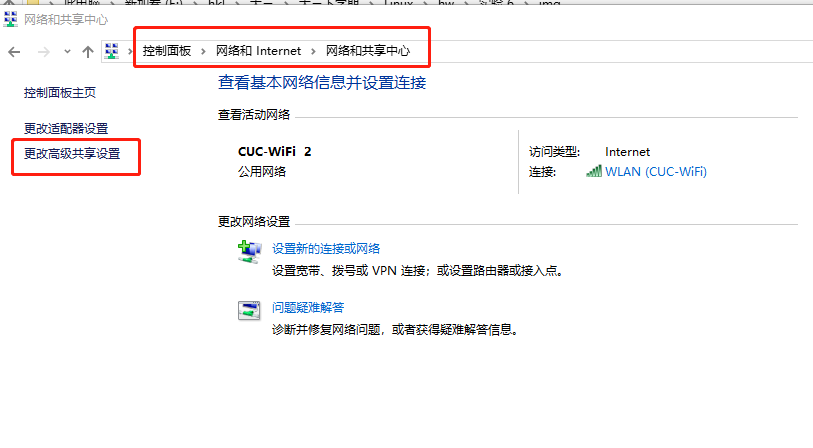
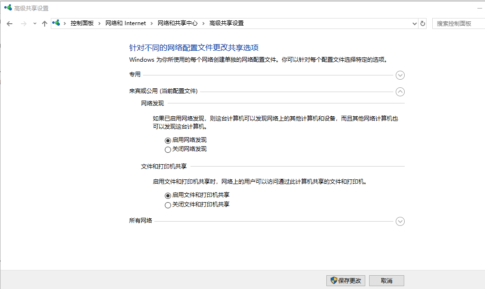
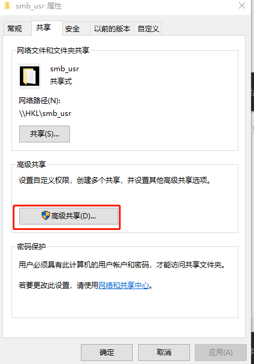
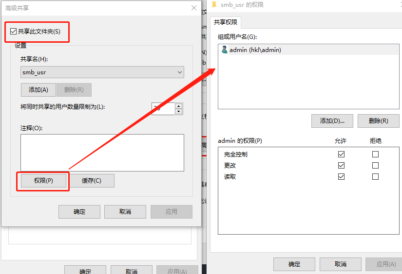
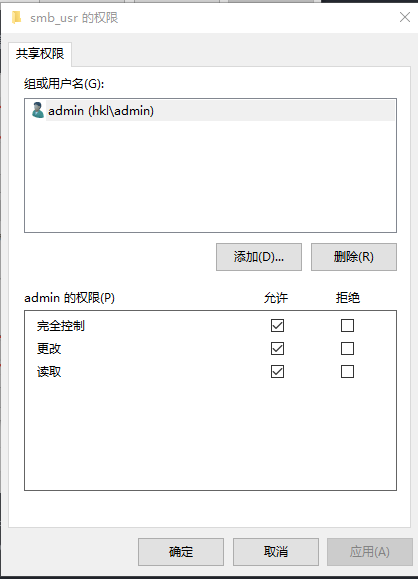
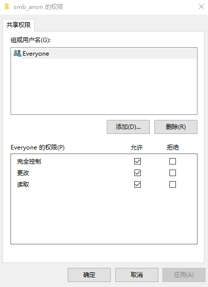
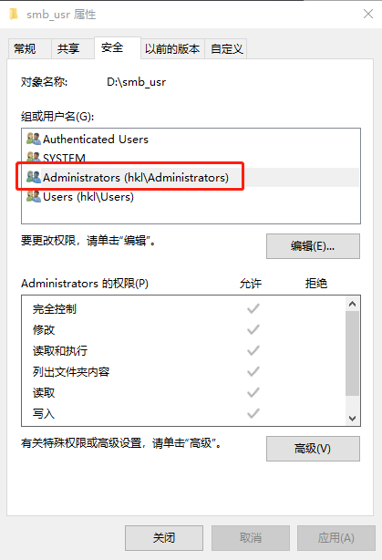
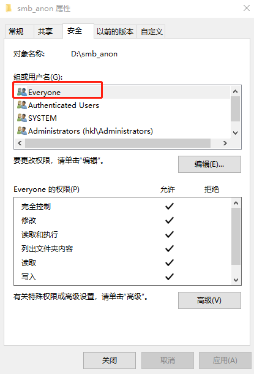
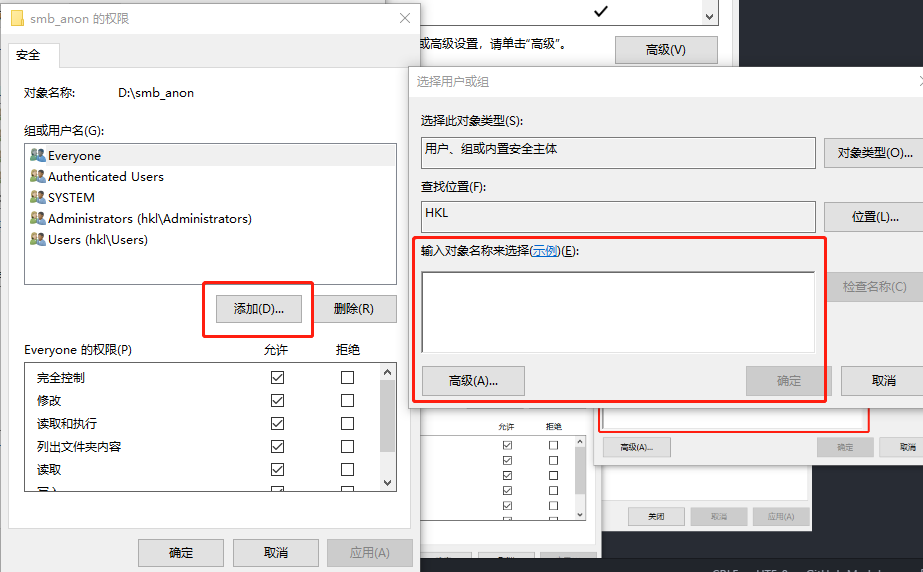

- [参考:How to Share Files Between Windows and Linux](https://www.howtogeek.com/176471/how-to-share-files-between-windows-and-linux/)

1. 打开控制面板，进入“网络和共享中心”，点击左侧“更改高级共享设置”

  
2. 开启网络发现和文件共享，保存更改

  
3. 编辑要共享的文件夹`D:smb_usr\`，属性

  
4. 勾选“共享此文件夹”，并点击权限

  
5. 添加用户名，设置权限。账号密码登录共享目录的用户为admin
，匿名登录共享目录的用户为Everyone

  
6. 回到文件夹属性的“安全栏”，更改对应用户的权限。若没有相关用户，如Everyone，则要添加（用户应与第5步设置相同）

