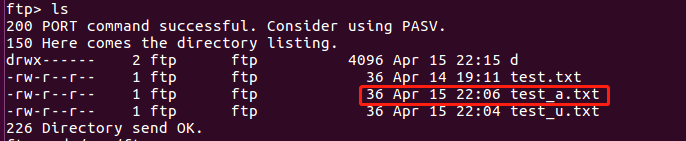
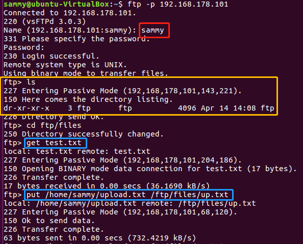
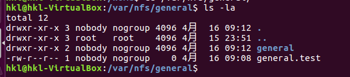
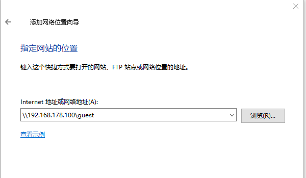
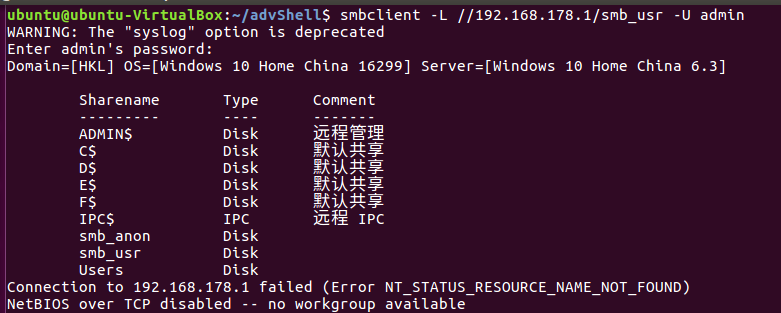

# SHELL脚本编程练习进阶（实验）
> FTP、NFS、DHCP、DNS、Samba服务器的自动安装与自动配置

## 完成情况

- [x] FTP,NFS所有必选任务，已编写脚本完成
- [x] Samba,DHCP,DNS手动配置完成

## 实验环境

- 工作主机（ubuntu-desktop-16.04）- 192.168.178.100
- 目标主机（ubuntu-desktop-16.04）- 192.168.178.101

> [自动安装与自动配置过程的启动脚本要求在本地执行（ssh免密root登录）](ssh免密root登录.md)

> 将脚本从工作主机拷贝到目标主机


## FTP

- [script](script/ftp.sh)

- [config](config/vsftpd.config)

- 配置一个提供匿名访问的FTP服务器，匿名访问者可以访问1个目录且仅拥有该目录及其所有子目录的只读访问权限

    - 注意：要在vsftpd.userlist中添加`anonymous`，才可以实现匿名访问

    

    

- 配置一个支持用户名和密码方式访问的账号，该账号继承匿名访问者所有权限，且拥有对另1个独立目录及其子目录完整读写（包括创建目录、修改文件、删除文件等）权限
    - 在sammy用户的目录下出现了匿名用户目录下的文件，可证明继承匿名者访问权限

    

    

    - 删除文件、创建目录、修改文件

    

- FTP用户不能越权访问指定目录之外的任意其他目录和文件

    

- 匿名访问权限仅限白名单IP来源用户访问，禁止白名单IP以外的访问

    - ref: [vsftpd : limit connection to a set of IP addresses](https://serverfault.com/questions/577393/vsftpd-limit-connection-to-a-set-of-ip-addresses)
    - 在`/etc/hosts.allow`中加入物理主机IP(192.168.178.1)之前，和加入物理主机IP之后的效果

    


- 参考

    - [How To Set Up vsftpd for Anonymous Downloads on Ubuntu 16.04](https://www.digitalocean.com/community/tutorials/how-to-set-up-vsftpd-for-anonymous-downloads-on-ubuntu-16-04)
    - [How To Set Up vsftpd for a User's Directory on Ubuntu 16.04](https://www.digitalocean.com/community/tutorials/how-to-set-up-vsftpd-for-a-user-s-directory-on-ubuntu-16-04)
    - [vsftpd for both local users and anonymous logins](https://serverfault.com/questions/844935/vsftpd-for-both-local-users-and-anonymous-logins)

## NFS

- script
    - [nfs_srv.sh](script/nfs_srv.sh)
    - [nfs_clt.sh](script/nfs_clt.sh)

- 在1台Linux上配置NFS服务，另1台电脑上配置NFS客户端挂载2个权限不同的共享目录，分别对应只读访问和读写访问权限

    

    - host的`/etc/exports`文件中，设置home目录为可读可写，general目录为只读

    ```

    /var/nfs/general 192.168.178.100(sync,no_subtree_check)

    /home    192.168.178.100(rw,sync,no_root_squash,no_subtree_check)

    ```

    - 可以在客户端home目录中创建文件，不可以在客户端general目录中创建文件

    

- 客户端共享目录中文件、子目录的属主、权限信息和在NFS服务器端上查看到的信息一样吗？

    - 客户端与服务器端一致
    - client

    

    - server

    

    - 参考资料解释

    > By default, NFS translates requests from a root user remotely into a non-privileged user on the server. This was intended as security feature to prevent a root account on the client from using the file system of the host as root. no_root_squash disables this behavior for certain shares.

    - 若没有`no_root_squash`参数(在general目录添加了写权限)
        - client

        

        - server

        

- 参考
    - [
 How To Set Up an NFS Mount on Ubuntu 16.04](https://www.digitalocean.com/community/tutorials/how-to-set-up-an-nfs-mount-on-ubuntu-16-04)

## Samba

### 在windows 10客户端上连接Linux上的Samba服务器

- [Linux_server_script](script/smb_srv.sh)

- [config](config/smb.conf)

- 打开资源管理器，右键“此电脑”，选择“添加一个网络位置”

    

- 输入共享文件夹路径

    

    

- 访问指定用户文件夹，需要输入账号密码，且可以创建文件夹

    

- 访问匿名目录，不用输入账号密码，且不可以创建文件夹

    

- ref: [How to connect to Linux Samba shares from Windows 10](https://www.techrepublic.com/article/how-to-connect-to-linux-samba-shares-from-windows-10/)


### 在Linux上连接Windows10上的服务器

> sudo apt-get install smbclient

- [设置Windows共享文件夹](在Linux和Windows间设置文件共享.md)

- Linux访问Windows的匿名共享目录

    - **问题**：匿名访问不成功，原因似乎在于win10对访问用户名的默认限制

    

    - 解决方式（不是很安全）

        

        

        - ref：[How to Create Network File Shares with No Passwords in Windows 8](https://www.howtogeek.com/126214/how-to-create-network-file-shares-with-no-passwords-in-windows-8/)


- Linux访问Windows的用户名密码方式共享目录

    

- 下载整个目录

    

    - ref: [Getting whole folder using Smbclient](https://indradjy.wordpress.com/2010/04/14/getting-whole-folder-using-smbclient/)

- 参考
    - [安装和配置SAMBA独立共享服务器](http://sec.cuc.edu.cn/huangwei/course/LinuxSysAdmin/chap0x06.md.html#/samba)
    - [Cannot restart samba, samba.service is masked](https://askubuntu.com/questions/754572/cannot-restart-samba-samba-service-is-masked)

## DHCP

- `sudo apt install isc-dhcp-server`

- 修改`/etc/default/isc-dhcp-server`文件

    

- 修改`/etc/dhcp/dhcpd.conf`文件

    

- 重启服务：`sudo service isc-dhcp-server restart`

- 测试

    - server

        

    - client

        - 更改`/etc/network/interfaces`文件

        

        - 重启网络`sudo /etc/init.d/networking restart`

        

- 参考
    - [Setup DHCP server on ubuntu 16.04 (Xenial Xerus) Server](http://www.ubuntugeek.com/setup-dhcp-server-on-ubuntu-16-04-xenial-xerus-server.html)

## DNS

- server

    - 安装Bind: `sudo apt-get install bind9 bind9utils bind9-doc`

    - 设置信任客户端：`sudo vi /etc/bind/named.conf.options`，添加

    ```

    acl "trusted" {
          192.168.178.100;    # ns1 - can be set to localhost
  	};  

    ```

    在options选项中添加

    ```
    	recursion yes;                 # enables resursive queries
        allow-recursion { trusted; };  # allows recursive queries from "trusted" clients
        listen-on { 192.168.178.101; };   # ns1 private IP address - listen on private network only
        allow-transfer { none; };      # disable zone transfers by default

        forwarders {
                8.8.8.8;
                8.8.4.4;
        };

    ```

    - 编辑`sudo vi /etc/bind/named.conf.local`

    

    - sudo mkdir /etc/bind/zones
    - cd /etc/bind/zones
    - sudo cp ../db.local ./db.cuc.edu.cn

    - 编辑`sudo vi /etc/bind/zones/db.cuc.edu.cn`

    

    - 重启bind9：`sudo service bind9 restart`


- client
    - `sudo vi /etc/resolvconf/resolv.conf.d/head`

    

    - `sudo resolvconf -u`

- 测试

    - Client

    

    

- 参考
    - [How To Configure BIND as a Private Network DNS Server on Ubuntu 14.04](https://www.digitalocean.com/community/tutorials/how-to-configure-bind-as-a-private-network-dns-server-on-ubuntu-14-04#prerequisites)

## bash-cheatsheet

- [How to include file in a bash shell script](https://stackoverflow.com/questions/10823635/how-to-include-file-in-a-bash-shell-script)
- [Check whether a user exists](https://stackoverflow.com/questions/14810684/check-whether-a-user-exists)
- [Check if a directory exists in a shell script](https://stackoverflow.com/questions/59838/check-if-a-directory-exists-in-a-shell-script)
- [How to append multiple lines to a file](https://unix.stackexchange.com/posts/77278/edit)
- [passing arguments to an interactive program non interactively
](https://stackoverflow.com/questions/14392525/passing-arguments-to-an-interactive-program-non-interactively)
