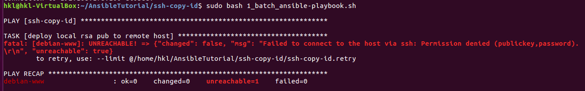
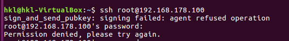
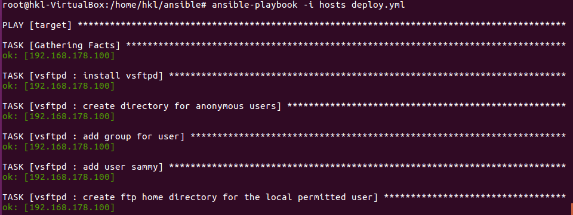
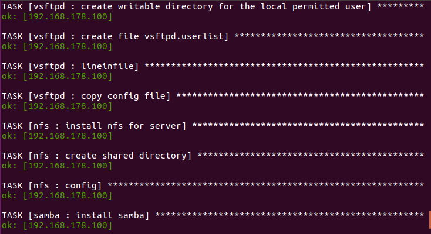
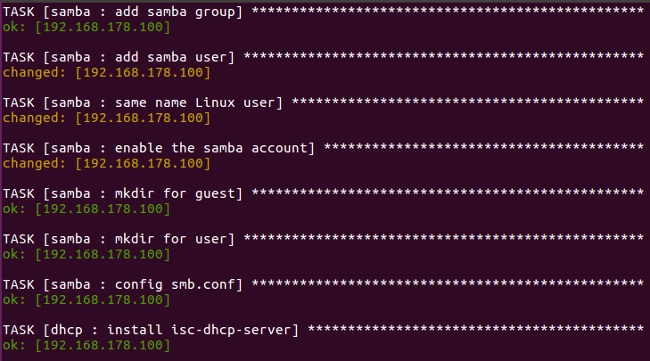
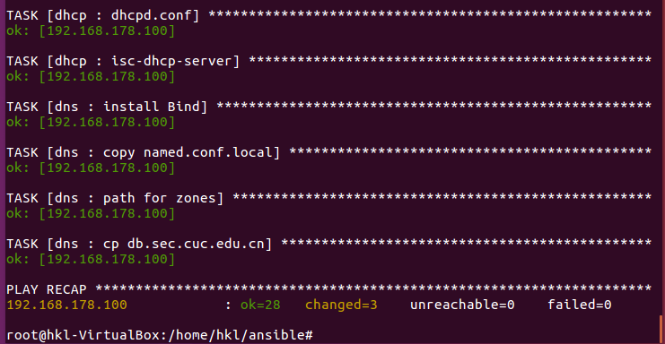

# 使用ansible技术重构FTP、NFS、DHCP、DNS、Samba服务器的自动安装与自动配置

## 问题 [Solved]：配置ssh root用户免密登陆报错

- /root目录下没有出现.ssh目录，没有构造出`id_rsa.pub`
    - [按照课件手动配置](http://sec.cuc.edu.cn/huangwei/course/LinuxSysAdmin/chap0x08.md.html#/12/2)，也无法成功实现root用户免密登陆

    

- 解决方法：
    - 一定要在sudo权限下运行两个脚本！（普通用户直接运行会报错）
    - `0_batch_ssh-copy-id.sh`脚本是将工作主机生成的公钥拷贝到目标主机的普通用户`.ssh`目录下
    - `ssh-copy-id.yml`可理解为将目标主机普通用户`.ssh`目录下的`authorized_keys`拷贝到root用户相应目录下
    - 报错是因为：使用普通用户运行`0_batch_ssh-copy-id.sh`导致拷贝的公钥是普通用户生成的，而运行`1_batch_ansible-playbook.sh`时却使用sudo权限，也就是使用root用户的公钥尝试登陆，二者不匹配，因此会报错。

## 实验思路

- 按照第6章实验中服务器的配置步骤，编写ansible脚本
- 在`deploy.yml`中用`roles`定义不同任务
- 每个`roles`中
    - `tasks`执行主脚本，实现配置功能
    - `defaults`定义配置变量信息
    - `handlers`负责配置后的重启服务
    - `templates`是改动好的定制配置文件

- 备注：新建用户时，要对用户密码计算哈希值才可以正常登录
    > mkpasswd --method=sha-512 "username"

## 实验结果

